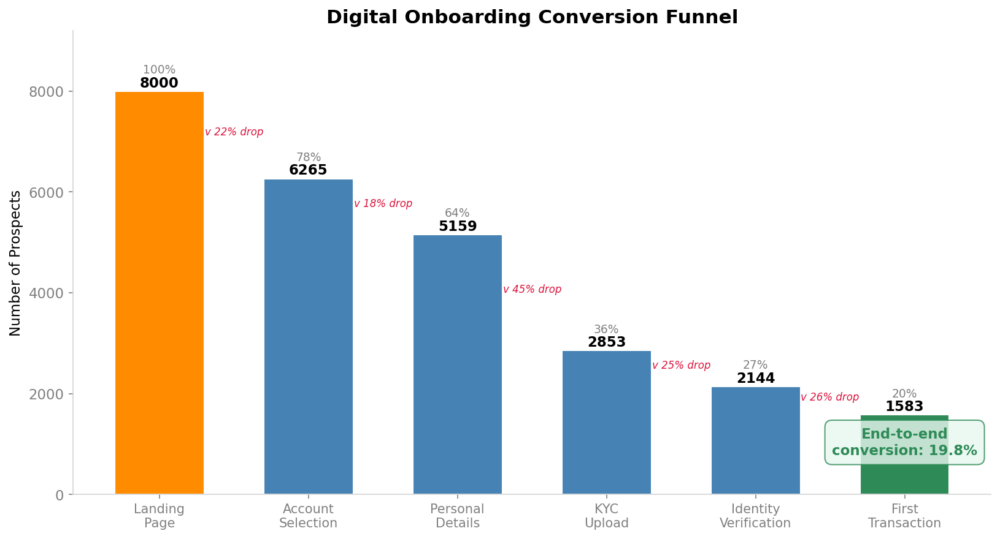
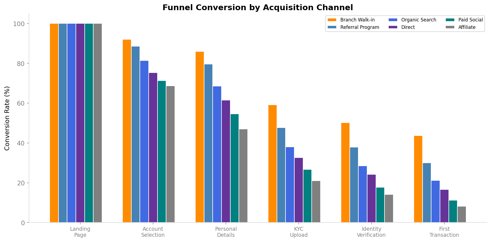
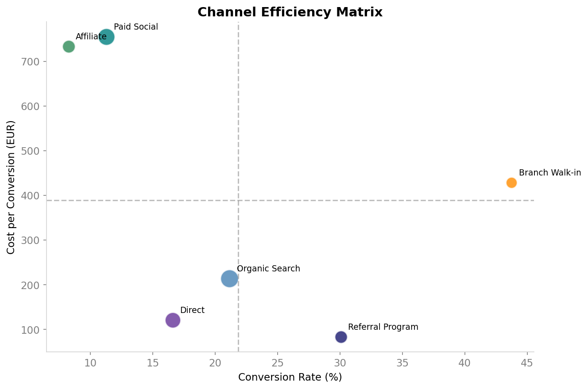
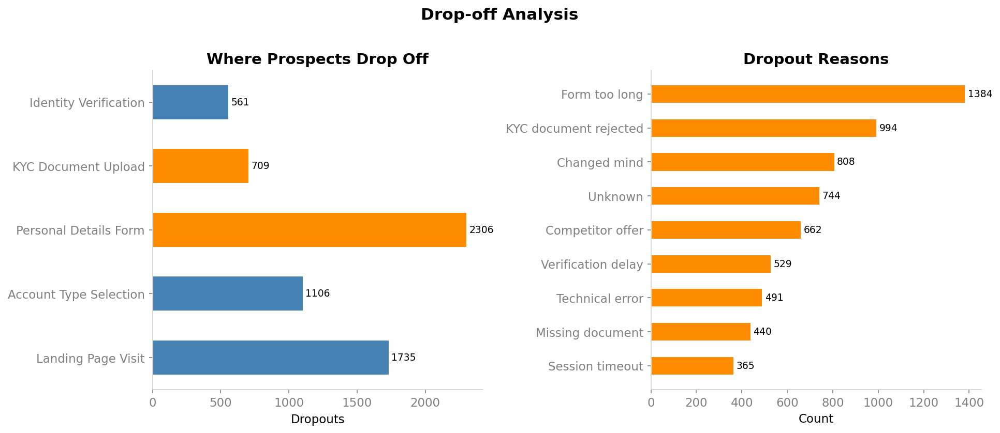
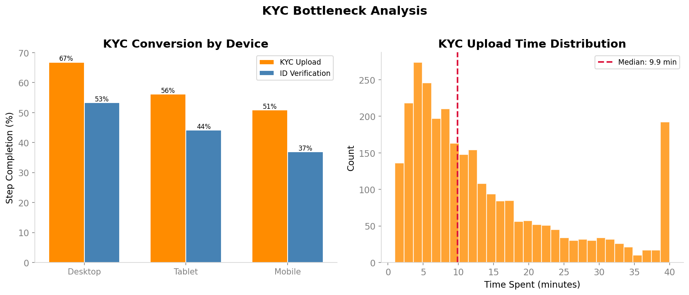

<p align="center">
  
</p>

# Customer Journey Optimization - Digital Onboarding

**Increasing onboarding conversion from 20% to a projected 30% by fixing the KYC bottleneck and reallocating channel spend.**

---

### Overview

This project maps 8,000 digital onboarding journeys to find where and why prospects drop off. SQL exploration reveals that KYC document upload is the biggest bottleneck (2,300 prospects lost) and that affiliate channels cost 9x more per conversion than referrals. The analysis includes a simulated A/B test showing that a simplified KYC form lifts conversion by 5.4%. Recommendations focus on fixing the KYC step and reallocating marketing budget.

### The Problem

A European retail bank acquires customers through 6 channels and puts each prospect through a 6-step digital onboarding funnel. Out of 8,000 prospects, 80% drop off before completing their first transaction. Marketing, Operations, and Product each own different pieces of this journey, and nobody has the full picture.

### About the Data

This project uses **synthetic data** generated by [`generate_data.py`](src/generate_data.py), with parameters calibrated against real European digital banking research:

| Parameter | Value | Source |
|:---|:---|:---|
| Overall abandonment rate | 68% of consumers abandon onboarding | Signicat "Battle to Onboard" 2022 |
| KYC as main drop-off | 68% of abandonments at ID verification | Signicat 2022 |
| Mobile traffic share | 68% mobile, 25% desktop, 7% tablet | Statista/EBF banking data |
| Mobile KYC penalty | Desktop converts 1.3-1.8x better | Signicat 2022 / industry benchmarks |
| CAC range | EUR 25 (Referral) to EUR 200 (Branch) | Industry benchmarks (neobank ~EUR 30, incumbent ~EUR 200) |
| Dropout reasons | 26% complexity, 23% ID issues | Signicat/Deloitte research |
| Cross-sell rate (90d) | 12% | Industry benchmark: 8-15% |

The dataset contains 8,000 onboarding journeys across 6 channels, 5 countries, and 4 product types over 12 months. Funnel step rates are conditional (each step depends on completing the previous one) with channel-specific and device-specific modifiers.

### The Approach

**Phase 1 - Explore the data with SQL**

Before diving into recommendations, I used SQL to map out the funnel and understand where people drop off. All 6 queries are in the [`sql/`](sql/) folder.

| total_prospects | step_1 | step_2 | step_3 | step_4 | step_5 | completed | conversion_rate_pct |
|---|---|---|---|---|---|---|---|
| 8,000 | 8,000 | 6,265 | 5,159 | 2,853 | 2,144 | 1,583 | 19.79 |

> The biggest drop is between Step 3 and Step 4. We lose about 2,300 people at KYC alone.

| acquisition_channel | total_prospects | completions | conversion_rate_pct |
|---|---|---|---|
| Branch Walk-in | 784 | 343 | 43.75 |
| Referral Program | 978 | 294 | 30.06 |
| Organic Search | 1,973 | 417 | 21.14 |
| Direct | 1,503 | 249 | 16.57 |
| Paid Social | 1,741 | 196 | 11.26 |
| Affiliate | 1,021 | 84 | 8.23 |

> Referral and Branch convert far better than paid channels.

| dropout_reason | dropout_count |
|---|---|
| Form too long | 1,384 |
| KYC document rejected | 994 |
| Changed mind | 808 |
| Unknown | 744 |
| Competitor offer | 662 |
| Verification delay | 529 |
| Technical error | 491 |
| Missing document | 440 |

> Form length and KYC rejection are the top two reasons. Both are fixable.

| acquisition_channel | total_prospects | completions | cost_per_conversion |
|---|---|---|---|
| Referral Program | 978 | 294 | EUR 83.23 |
| Direct | 1,503 | 249 | EUR 120.45 |
| Organic Search | 1,973 | 417 | EUR 213.95 |
| Branch Walk-in | 784 | 343 | EUR 428.47 |
| Affiliate | 1,021 | 84 | EUR 733.14 |
| Paid Social | 1,741 | 196 | EUR 755.03 |

> Affiliates and Paid Social cost 9x more per conversion than Referral.

**Phase 2 - Visualize patterns with Python**

Using the SQL findings, I built visualizations in [`analyze.py`](src/analyze.py) to explore funnel behavior by channel, device type, age group, and time spent per step.

<table>
<tr>
<td width="50%"><br><sub>Funnel varies dramatically by acquisition source</sub></td>
<td width="50%"><br><sub>Referral sits in the "scale" quadrant, Affiliate is worst</sub></td>
</tr>
<tr>
<td width="50%"><br><sub>KYC and personal details are the biggest loss points</sub></td>
<td width="50%"><br><sub>Mobile and older users disproportionately struggle at KYC</sub></td>
</tr>
</table>

**Phase 3 - A/B test for simplified KYC form**

I designed and ran a simulated A/B test to validate the hypothesis that splitting the single-step KYC form into a simplified 2-step process would improve Step 4 conversion. The test code is in [`ab_test.py`](src/ab_test.py).

- Prospects were split 50/50 into control and test groups using a hash of prospect_id
- The test group received a simplified KYC flow
- A two-proportion z-test was used with alpha = 0.05

**Result:** The simplified form produced a statistically significant **+5.4% lift** in Step 4 conversion (p = 0.028). This confirms the KYC step is a design problem, not a customer problem.

**Phase 4 - Recommendations**

| Action | Expected Impact | Owner |
|--------|----------------|-------|
| 2x Referral Program investment | +200 conversions/year at EUR 83 each | Marketing |
| Exit bottom 50% of Affiliate partners | Save EUR 80K+ annually | Marketing |
| Mobile KYC redesign: camera scan + auto-crop | +8% mobile step conversion | Product |
| Split personal details form into 2 steps | Reduce "form too long" dropouts by 40% | Product |
| Video-call KYC option for 55+ segment | +15% KYC conversion for older users | Operations |
| 90-day nurture program for new customers | +25% activation rate | CRM |

### How to Read This Analysis

| File | What it does |
|------|-------------|
| [`generate_data.py`](src/generate_data.py) | Creates 8,000 synthetic onboarding journeys with realistic funnel behavior and channel costs |
| [`analyze.py`](src/analyze.py) | Funnel analysis, channel ROI, post-onboarding quality metrics, and all 10 visualizations |
| [`ab_test.py`](src/ab_test.py) | Simulated A/B test for a simplified KYC form: hypothesis, test design, and statistical analysis |
| [`run_ab_test.py`](src/run_ab_test.py) | Executes the A/B test and generates test result charts |
| [`sql/`](sql/) | 6 PostgreSQL-compatible queries covering funnel overview, channel conversion, dropout reasons, device comparison, channel cost, and post-onboarding behavior |
| [`run.py`](run.py) | Runs the full pipeline end to end |
| [`style_config.py`](style_config.py) | Defines chart styling using matplotlib named colors and rcParams |

To run: `python run.py`

Note: Chart styling is defined in [`style_config.py`](style_config.py) using matplotlib named colors.

### Project Structure

```
customer-journey-optimization/
├── src/
│   ├── generate_data.py       # Funnel data simulator
│   ├── analyze.py             # Cross-functional analysis
│   ├── ab_test.py             # A/B test: KYC simplification
│   └── run_ab_test.py         # Execute the A/B test
├── sql/                       # 6 PostgreSQL-compatible analysis queries
├── data/                      # Funnel dataset
├── ./outputs/figures/           # All 12 visualizations (incl. A/B test)
├── docs/
│   └── executive_brief.md
├── style_config.py            # Chart styling (matplotlib named colors + rcParams)
├── run.py
└── requirements.txt
```

---

<sub>Built by Sanjana</sub>
